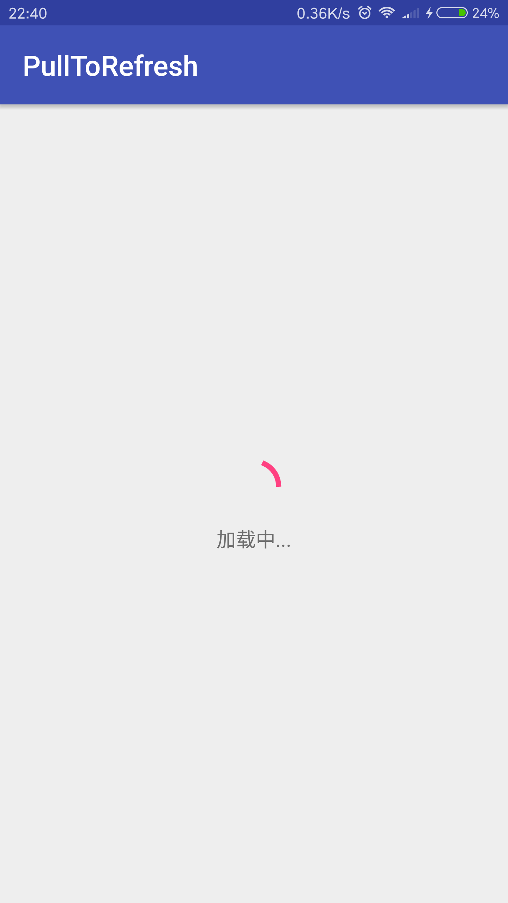
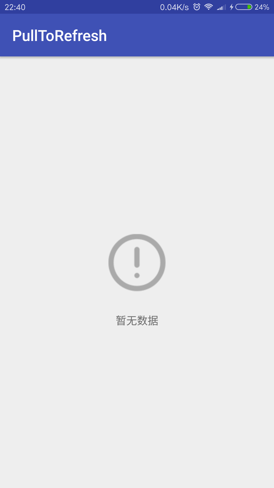
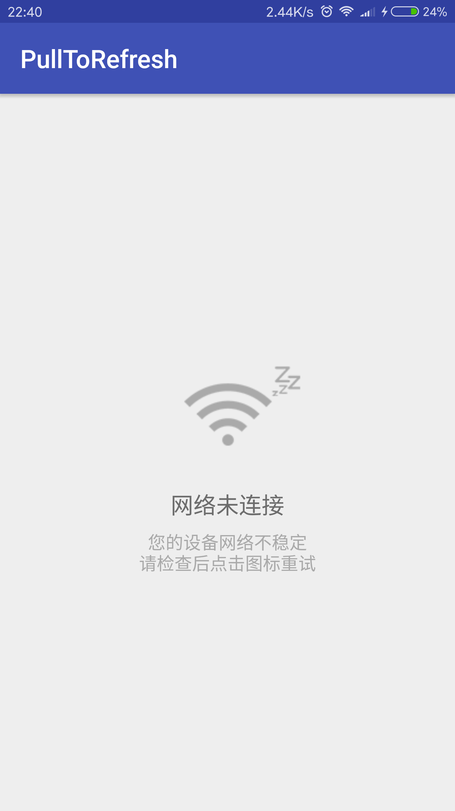

# PullToRefresh

开发者可以使用 `PullToRefresh` 对各种控件实现下拉刷新或者上拉加载以及可以自定义刷新和加载部分的视图。

目前支持：`ScrollView `，`ListView`，`WebView`，`RecyclerView`。

## 版本记录

#### v1.0.3
修复了滑动最小距离判断

#### v1.1.0
新增了空数据，加载中以及网络错误的3种状态页面

#### v1.2.0
1、修复了ypf168326 [issue](https://github.com/823546371/PullToRefresh/issues/2) 并添加了例子
2、修复了刷新加载期间不能滑动的问题

#### v1.2.5
新增自定义不用每次都设置头部和底部demo

#### v1.2.6
1、fix bug <br />
2、新增自动刷新(autoRefresh),禁止刷新(canRefresh)

#### v1.2.7
1、fix issue#9 <br />

## 效果图


## 基本用法

### 1、添加 Gradle 依赖
> 目前只支持 Android Studio

``` gradle
compile 'com.jwenfeng.pulltorefresh:library:1.2.7'
```

### 2、布局文件
注意：内容控件 有且只能有一个，目前支持：`ScrollView `，`ListView`，`WebView`，`RecyclerView`。

``` xml
<?xml version="1.0" encoding="utf-8"?>
<com.jwenfeng.library.pulltorefresh.PullToRefreshLayout 
    xmlns:android="http://schemas.android.com/apk/res/android"
    android:id="@+id/activity_main"
    android:layout_width="match_parent"
    android:layout_height="match_parent">
    
    <!-- 内容控件 有且只能有一个 -->
     <ScrollView
        android:layout_width="match_parent"
        android:layout_height="match_parent">
    
     </ScrollView>
    
</com.jwenfeng.library.pulltorefresh.PullToRefreshLayout>
    
```

### 3、在Activity或者Fragment中使用

``` java
pullToRefreshLayout.setRefreshListener(new BaseRefreshListener() {
            @Override
            public void refresh() {
                new Handler().postDelayed(new Runnable() {
                    @Override
                    public void run() {
                        // 结束刷新
                        pullToRefreshLayout.finishRefresh();
                    }
                }, 2000);
            }

            @Override
            public void loadMore() {
                new Handler().postDelayed(new Runnable() {
                    @Override
                    public void run() {
                        // 结束加载更多
                        pullToRefreshLayout.finishLoadMore();
                    }
                }, 2000);
            }
        });
```

### 4、自定义视图

自定义下拉刷新视图需要实现 `HeadView` 接口

``` java
public interface HeadView {

    /**
     * 开始下拉
     */
    void begin();

    /**
     * 回调的精度,单位为px
     *
     * @param progress 当前高度
     * @param all      总高度
     */
    void progress(float progress, float all);

    void finishing(float progress, float all);
    /**
     * 下拉完毕
     */
    void loading();

    /**
     * 看不见的状态
     */
    void normal();

    /**
     * 返回当前视图
     * */
    View getView();

}
```
具体请参考Demo中 [HeadRefreshView](https://github.com/823546371/PullToRefresh/blob/master/library/src/main/java/com/jwenfeng/library/pulltorefresh/view/HeadRefreshView.java)

上拉加载更多用法和下拉刷新类似，具体参考 [LoadMoreView.java](https://github.com/823546371/PullToRefresh/blob/master/library/src/main/java/com/jwenfeng/library/pulltorefresh/view/LoadMoreView.java)

不用每次都设置头部和底部啦，可以继承PullToRefreshLayout，具体参考 [NormalPullToRefreshLayout](https://github.com/823546371/PullToRefresh/blob/master/app/src/main/java/com/jwenfeng/pulltorefresh/view/NormalPullToRefreshLayout.java)
### 5、其他

可以设置下拉刷新和上拉加载控件的高度和拉取的最大高度，默认为60dp，最大拉取为120dp,可自行设置。


### 6、v1.1.0 新增自定义3中状态页面

#### 截图





#### 用法

###### XML

``` xml
<com.jwenfeng.library.pulltorefresh.PullToRefreshLayout
    xmlns:android="http://schemas.android.com/apk/res/android"
    xmlns:app="http://schemas.android.com/apk/res-auto"
    android:id="@+id/activity_recycler_view"
    android:layout_width="match_parent"
    android:layout_height="match_parent"
    app:view_error="@layout/layout_error"
    app:view_empty="@layout/layout_empty"
    app:view_loading="@layout/layout_loading">

</com.jwenfeng.library.pulltorefresh.PullToRefreshLayout>
```

app:view_error    网络错误页面

app:view_empty    空数据页面

app:view_loading  加载中页面

该三个属性可以不填写，默认样式为上图所示，可以自定义


###### java用法

``` java
pullToRefreshLayout.showView(ViewStatus.LOADING_STATUS);
```
设置需要显示的视图
``` java
// 获取页面
View error = pullToRefreshLayout.getView(ViewStatus.ERROR_STATUS);
```
获取所需要的视图view

## 注意 一定要在调用了设置相应的视图之后才可以调用获取页面，否则view为空


## License

```
Copyright 2016-2017 jinwenfeng

Licensed under the Apache License, Version 2.0 (the "License");
you may not use this file except in compliance with the License.
You may obtain a copy of the License at

   http://www.apache.org/licenses/LICENSE-2.0

Unless required by applicable law or agreed to in writing, software
distributed under the License is distributed on an "AS IS" BASIS,
WITHOUT WARRANTIES OR CONDITIONS OF ANY KIND, either express or implied.
See the License for the specific language governing permissions and
limitations under the License.
```


